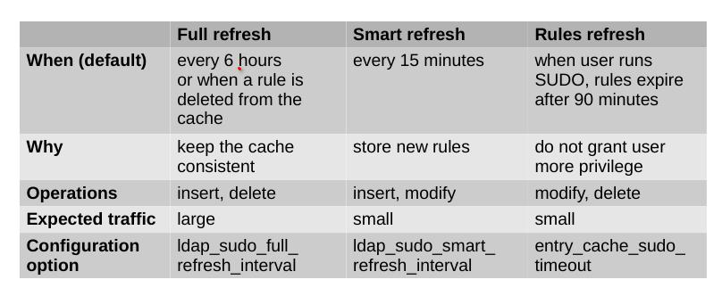

# manual install
```bash
# generate OTP on the server
ipa host-add ldap-test.domainname.com --random
# on the client
yum install -y ipa-client
ipa-client-install --password "INSERT_PASSWORD" \
--domain int.domainname.com --unattended \
--no-sshd # don't configure openssh
```

# uninstall
```
ipa-client-install --uninstall -U
ipa host-del hostname --updatedns
```


# disable default HBAC allow all policy & create custom
Host-Based Access Control > allow_all > disable


# [OPTIONAL] disable SSHD password auth
```bash
# /etc/ssh/sshd_config
ChallengeResponseAuthentication no
```

# [OPTIONAL] fix SSHD key auth when installed with --no-sshd
```bash
# /etc/ssh/sshd_config
AuthorizedKeysCommandUser nobody
AuthorizedKeysCommand /usr/bin/sss_ssh_authorizedkeys
```

# force rules refresh
sss_cache --help

# HBAC rules CACHE
ipa_hbac_refresh

# sudo rules CACHE
ldap_sudo_full_refresh_interval   - replace all local with LDAP rules (with deletion)
ldap_sudo_smart_refresh_interval  - replace new or modified (no deletions)
on every sudo from user           - refresh all expired rules, triggers full refresh if any rule is deleted
https://linux.die.net/man/5/sssd-ldap



# ssh login success log example
```log
debug1: userauth_pubkey: test whether pkalg/pkblob are acceptable for RSA SHA256:PwgXKQkSY2ZDLXxKKRC2blxYNYRoOuoMGFpYnnwTJWQ [preauth]
debug1: temporarily_use_uid: 99/99 (e=0/0)
debug1: restore_uid: 0/0
debug1: temporarily_use_uid: 99/99 (e=0/0)
debug1: matching key found: file /usr/bin/sss_ssh_authorizedkeys, line 1 RSA SHA256:PwgXKQkSY2ZDLXxKKRC2blxYNYRoOuoMGFpYnnwTJWQ
debug1: restore_uid: 0/0
Postponed publickey for username from 185.36.156.178 port 42050 ssh2 [preauth]
debug1: userauth-request for user username service ssh-connection method publickey [preauth]
debug1: attempt 3 failures 1 [preauth]
debug1: temporarily_use_uid: 99/99 (e=0/0)
debug1: restore_uid: 0/0
debug1: temporarily_use_uid: 99/99 (e=0/0)
debug1: matching key found: file /usr/bin/sss_ssh_authorizedkeys, line 1 RSA SHA256:PwgXKQkSY2ZDLXxKKRC2blxYNYRoOuoMGFpYnnwTJWQ
debug1: restore_uid: 0/0
debug1: do_pam_account: called
Accepted publickey for username from 185.36.156.178 port 42050 ssh2: RSA SHA256:PwgXKQkSY2ZDLXxKKRC2blxYNYRoOuoMGFpYnnwTJWQ
debug1: monitor_child_preauth: username has been authenticated by privileged process
```

# troubleshoot sssd
https://docs.pagure.org/SSSD.sssd/users/troubleshooting.html
https://docs.pagure.org/SSSD.sssd/users/sudo_troubleshooting.html

```bash
#/etc/sssd/sssd.conf
[sudo]
debug_level = 0x3ff0

[domain/$NAME]
debug_level = 0x3ff0

systemctl restart sssd
tail -f  /var/log/sssd/sssd_$NAME.log
tail -f /var/log/sssd/sssd_sudo.log
```


# create user for host enrollment
And fix role "Enrollment Administrator" (Joining realm failed: No permission to join this host to the IPA domain)
```bash
ipa privilege-add-permission 'Host Enrollment' --permissions='System: Add Hosts'
ipa privilege-add-permission 'Host Enrollment' --permissions='System: Remove Hosts'
```

# automember
```bash
ipa automember-add-condition \
--type=['hostgroup'] \
--key="fqdn" \
--inclusive-regex=".*" \
--key="memberOf" \
--exclusive-regex="cn=ipaservers,cn=hostgroups,cn=accounts.*" \
ipaclients


```

# disable sudo password
```
ipa sudorule-add defaults
ipa sudorule-add-option defaults --sudooption '!authenticate'

```
